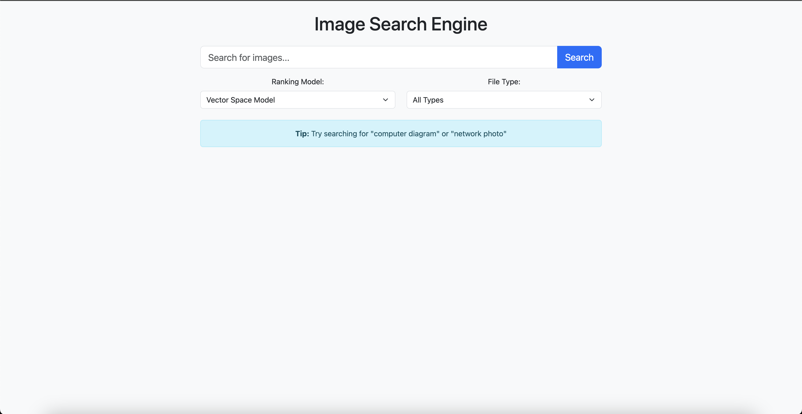

# Image Search Engine

A Python-based image search engine that crawls Wikipedia for images, processes their metadata, builds a search index, and provides a web interface for searching. Built with Flask, BeautifulSoup, and NLTK.

 <!-- Add a screenshot later -->

## Features
- Web crawler for Wikipedia images
- Textual surrogate creation from image metadata
- TF-IDF and BM25 ranking algorithms
- Web-based search interface
- Filetype filtering

## Prerequisites
- Python 3.8+
- pip
- git (optional)

## Installation & Setup

### 1. Clone the repository
```bash
git clone https://github.com/aaqidmasoodi/Image-Search-Engine.git
cd Image-Search-Engine
```

### 2. Create and activate virtual environment
```bash
# On Windows
python -m venv venv
venv\Scripts\activate

# On macOS/Linux
python3 -m venv venv
source venv/bin/activate
```

### 3. Install dependencies
```bash
pip install -r requirements.txt
```

## Running the Project

### Step 1: Scrape Images *(Optional - pre-scraped data included)*
Run the web crawler to gather images from Wikipedia:
```bash
python scrapper.py
```
*Note: This may take time as it downloads ~1000 images. Pre-scraped data is included in the repository.*

### Step 2: Parse Metadata
Process the scraped images into searchable documents:
```bash
python parser.py
```

### Step 3: Build Search Index
Create the search index from parsed documents:
```bash
python indexing.py
```

### Step 4: Launch Web Interface
Start the Flask web application:
```bash
python app.py
```
Access the search interface at: [http://localhost:5001](http://localhost:5001)

## Project Structure
```
.
├── app.py                # Flask web application
├── indexing.py           # Index builder
├── parser.py             # Metadata parser
├── scrapper.py           # Web crawler
├── ranking.py            # Search algorithms
├── preprocess.py         # Text processing
├── search.py             # Search interface
├── requirements.txt      # Dependencies
├── static/               # Static files
│   ├── css/              # CSS styles
│   └── images/           # Downloaded images
├── templates/            # HTML templates
│   ├── base.html         # Base template
│   ├── index.html        # Search page
│   └── results.html      # Results page
├── image_metadata.json   # Scraped image data
└── image_index.pkl       # Search index
```

## Sample Queries
Try these example searches:

- `computer diagram`
- `network photo filetype:png`
- `science chart`

## Troubleshooting

**Port 5000 already in use:**
```bash
# Edit app.py and change the port:
app.run(host='0.0.0.0', port=5001, debug=True)
```

**Missing NLTK data:**
```bash
python -c "import nltk; nltk.download('punkt'); nltk.download('stopwords')"
```

## License
MIT License

## Acknowledgements
- Wikipedia for image content  
- NLTK for text processing  
- Flask for web interface
